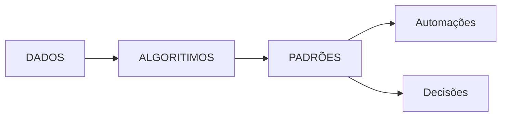
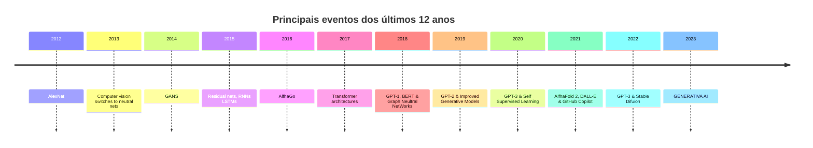

# Módulo 1 - Introdução a Inteligencia Artificial

> [voltar](./notes.md) para página anterior.

## Sumário

- [Módulo 1 - Introdução a Inteligencia Artificial](#módulo-1---introdução-a-inteligencia-artificial)
  - [Sumário](#sumário)
  - [Objetívo do módulo](#objetívo-do-módulo)
  - [Conteúdo](#conteúdo)
    - [O que é Inteligência Artificial?](#o-que-é-inteligência-artificial)
      - [Visão Formal](#visão-formal)
      - [Visão Filosófica](#visão-filosófica)
      - [Definição ChatGPT 3.5](#definição-chatgpt-35)
    - [Por que usar IA?](#por-que-usar-ia)
    - [Diagrama](#diagrama)
    - [Linha do Tempo](#linha-do-tempo)
    - [Fundamentos](#fundamentos)
      - [Ramificações](#ramificações)
    - [Tipos de IA](#tipos-de-ia)
    - [Aplicação](#aplicação)
      - [Análise Preditiva](#análise-preditiva)
      - [Sistema de Recomendação](#sistema-de-recomendação)
      - [Visão Computacional](#visão-computacional)
      - [Reconhecimento de Padrões](#reconhecimento-de-padrões)
      - [Detecção de Anomalias e a Clusterização](#detecção-de-anomalias-e-a-clusterização)
      - [Processamento da Linguagem Neural](#processamento-da-linguagem-neural)
      - [Séries Temporais](#séries-temporais)
      - [Aprendizado Por Reforço](#aprendizado-por-reforço)
      - [Segurança Sibernética](#segurança-sibernética)

## Objetívo do módulo

Expolorar os conceitos e fundamentos da inteligência artificial, como o objetivo de definir melhor quais caminhos podemos seguir para este tipo de aplicação, que problemas a IA resolve e posicioná-la em termos de passado, presente e futuro.

## Conteúdo

### O que é Inteligência Artificial?

#### Visão Formal

É um campo da ciência da computação que envolve a criação de agentes inteligentes, que podem raciocinar, aprender e agir de forma autônoma. A IA é uma área ampla e interdisciplinar, que inclui subcampos [aprendizado de máquina], [processamento de linguagem neural], [visão computacional] e robótica.

#### Visão Filosófica

A arte de criar máquinas que executam funções que requerem inteligência quando executadas por pessoas.

#### Definição ChatGPT 3.5

A definição de inteligência artificial (IA) pode variar dependendo da perspectiva a partir da qual você a aborda. Vou fornecer três visões diferentes sobre o que é a IA:

1. Visão Simplista:
   Na visão simplista, a inteligência artificial é uma tecnologia que permite que máquinas executem tarefas que, normalmente, requerem inteligência humana. Isso inclui coisas como reconhecimento de fala, processamento de linguagem natural, resolução de problemas complexos e até mesmo a capacidade de aprender e se adaptar com base em dados.

2. Visão Tecnológica:
   Do ponto de vista tecnológico, a inteligência artificial se refere a um campo da ciência da computação que se concentra no desenvolvimento de algoritmos, sistemas e hardware que podem simular ou replicar funções cognitivas humanas. Isso envolve a criação de modelos matemáticos, redes neurais artificiais e o uso de grandes conjuntos de dados para treinar algoritmos a fim de realizar tarefas específicas, como reconhecimento de imagem, classificação de texto e tomada de decisões.

3. Visão Filosófica:
   A perspectiva filosófica da inteligência artificial levanta questões profundas sobre a natureza da inteligência, consciência e o que significa ser "inteligente". Alguns filósofos acreditam que a IA poderia eventualmente alcançar um nível de inteligência que se assemelha à humana, enquanto outros argumentam que a IA é apenas uma forma de simulação de inteligência e não possui verdadeira compreensão ou consciência. A ética também desempenha um papel importante na discussão filosófica da IA, abordando questões sobre responsabilidade, autonomia e os impactos sociais da IA na sociedade.

Essas três visões abordam a inteligência artificial de diferentes ângulos, destacando sua natureza tecnológica, seu potencial e suas implicações mais amplas na sociedade e na filosofia. A IA é um campo em constante evolução que continua a desafiar nossas concepções sobre o que é a inteligência e como ela pode ser replicada ou ampliada por meio da tecnologia.

> [voltar](#sumário) para o topo da página.

### Por que usar IA?

A inteligência artificial traz diversos benefícios para as empresas. Primeiro, ela permite a automação de tarefas repetitivas e de baixo valor agregado, liberando os profissionais para atividades mais estratégicas. Além disso, a inteligência artificial melhora a tomada de decisão ao analisar grandes conjuntos de dados e identificar padrões e tendências. Ela também contribui para a criação de experiências personalizadas para os clientes, como recomendação de produtos e serviços. Esses benefícios incluem a redução de custos, a segurança da informação e a visibilidade de mercado. Em resumo, a IA permite:

- Automação
- Tomada de decisão
- Experiência do cliente
- Redução de custos
- Melhorar segurança
- Ampliar inovaçaõ

> retornar ao [**sumário**](#sumário).

### Diagrama

> retornar ao [**sumário**](#sumário).

### Linha do Tempo

A linha do tempo abaixo fornece uma visão geral das principais realizações e desenvolvimentos na história da inteligência artificial. A IA continua a evoluir rapidamente, e novos marcos estão sendo alcançados constantemente à medida que a pesquisa e a aplicação prática da IA avançam.

1. **Década de 1940 e 1950**:
   - 1943: Warren McCulloch e Walter Pitts desenvolvem um modelo simplificado de neurônios artificiais.
   - 1950: Alan Turing propõe o "Teste de Turing" para avaliar a capacidade de uma máquina de exibir comportamento inteligente.
   - 1956: John McCarthy cunha o termo "inteligência artificial" e organiza a primeira conferência de IA em Dartmouth College.

2. **Década de 1960**:
   - Surgem as primeiras linguagens de programação específicas para IA, como o LISP.
   - Desenvolvimento de programas de IA baseados em regras.

3. **Década de 1970**:
   - Expansão do uso de sistemas especialistas, que usam regras de inferência para resolver problemas específicos.
   - A IA simbólica domina a pesquisa em IA.

4. **Década de 1980**:
   - A IA perde parte de seu apoio financeiro e entra em um período chamado "inverno da IA" devido a expectativas exageradas e resultados limitados.
   - Surgimento da IA conexionista, com redes neurais artificiais.

5. **Década de 1990**:
   - A IA se recupera com avanços em machine learning e redes neurais.
   - Desenvolvimento de sistemas de recomendação e algoritmos de aprendizado de máquina.

6. **Década de 2000**:
   - Aprendizado profundo (deep learning) ganha destaque com o uso de redes neurais profundas para reconhecimento de padrões em grandes conjuntos de dados.
   - Avanços na IA são aplicados em campos como visão computacional e processamento de linguagem natural.

7. **Década de 2010**:
   - Grandes avanços em IA com o uso de dados massivos e algoritmos de aprendizado profundo.
   - Surgimento de assistentes virtuais como a Siri da Apple e a Alexa da Amazon.
   - Progressos notáveis em veículos autônomos e jogos de tabuleiro, como o AlphaGo da DeepMind.

8. **Década de 2020**:
   - A IA continua a se integrar na vida cotidiana com aplicativos em áreas como saúde, finanças e transporte.
   - Questões éticas e regulatórias em torno da IA ganham destaque.
   - Pesquisa em IA avançada, como IA generativa (GPT-3) e sistemas autônomos, continua a progredir.

Começamos destacando marcos importantes, como o lançamento do AlphaGo pelo Google em 2017, que venceu o campeão mundial de Go. Também mencionamos as Generative Adversarial Networks (GANs), criadas em 2014, que foram um marco para as IAs generativas. Em 2017, a arquitetura de Transformer foi introduzida, sendo a base dos modelos GPT da OpenAI. Ao longo dos anos, várias redes generativas foram desenvolvidas, como o GPT-1, GPT-2, GPT-3, Dalek e GitHub Copilot. Em 2022, estamos na era da IA generativa. Além disso, abordamos marcos anteriores, como o teste de Turing em 1950 e a criação do termo "inteligência artificial" em 1955. Também mencionamos o "inverno da IA", um período de baixo desenvolvimento, e marcos posteriores, como o computador Deep Blue da IBM vencendo o campeão de xadrez em 1997 e o surgimento de assistentes como Siri, Watson e Alexa.

> [voltar](#sumário) para o topo da página.

### Fundamentos

A Inteligência Artificial (IA) é um campo multidisciplinar que se concentra no desenvolvimento de sistemas e algoritmos capazes de realizar tarefas que, de alguma forma, exigem inteligência humana. Estes sistemas são projetados para aprender, raciocinar, tomar decisões e resolver problemas de maneira autônoma, com base em padrões identificados nos dados.

#### Ramificações

**1. Aprendizado de Máquina (Machine Learning):**
O Aprendizado de Máquina é uma das subáreas mais proeminentes da IA. Ele se concentra no desenvolvimento de algoritmos e técnicas que permitem aos sistemas aprender com dados e melhorar seu desempenho ao longo do tempo. Isso inclui o Aprendizado Supervisionado, Não Supervisionado e por Reforço, bem como técnicas de Deep Learning.

**2. Processamento de Linguagem Natural (PLN):**
O PLN envolve a capacidade dos sistemas de IA de compreender, interpretar e gerar linguagem humana. Isso é fundamental para aplicações como chatbots, tradução automática, análise de sentimentos, resumo de texto e até mesmo assistentes virtuais como Siri e Alexa.

**3. Visão Computacional:**
Esta subárea se concentra na capacidade das máquinas de interpretar informações visuais a partir de imagens e vídeos. Isso inclui detecção de objetos, reconhecimento facial, rastreamento de movimento, realidade aumentada e análise de imagem médica.

**4. Robótica Inteligente:**
A Robótica Inteligente combina IA com robótica para criar sistemas autônomos capazes de realizar tarefas físicas complexas. Isso inclui robôs autônomos, carros autônomos e drones.

**5. Raciocínio e Planejamento:**
Essa subárea trata da capacidade dos sistemas de IA de raciocinar logicamente e tomar decisões informadas. Pode ser aplicada em sistemas de diagnóstico médico, sistemas de recomendação e planejamento logístico.

**6. Sistemas Especialistas:**
Os sistemas especialistas são programas de IA que resolvem problemas específicos usando conhecimento humano armazenado em forma de regras. Eles são utilizados em diagnóstico médico, suporte à decisão e em aplicações industriais.

**7. Aprendizado por Reforço:**
O Aprendizado por Reforço envolve a capacidade de um agente aprender a tomar decisões através da interação com um ambiente e da recepção de recompensas. Isso é fundamental em aplicações como jogos, controle de robôs e otimização de processos.

**8. Ética e Responsabilidade em IA:**
Uma subárea emergente, esta aborda questões éticas relacionadas ao desenvolvimento e uso da IA. Ela se concentra em garantir que os sistemas de IA sejam justos, transparentes e não discriminatórios, além de lidar com preocupações sobre privacidade e segurança.

**9. IA em Saúde:**
A IA é amplamente aplicada na área da saúde, incluindo diagnóstico médico, descoberta de medicamentos, gestão de registros de saúde e personalização de tratamentos.

**10. IA em Finanças:**
Neste campo, a IA é usada para análise de dados financeiros, detecção de fraudes, previsão de mercado, negociação algorítmica e gerenciamento de riscos.

**11. IA em Educação:**
A IA é aplicada em sistemas de tutoria inteligente, personalização de currículos, avaliação de aprendizado e automação de tarefas administrativas nas instituições educacionais.

Essas são apenas algumas das principais subáreas da IA, e há muitas outras especializações e aplicações em desenvolvimento contínuo. A IA é uma disciplina em constante evolução, com o potencial de transformar diversos setores e aspectos da vida cotidiana à medida que novas descobertas e inovações são alcançadas.

> [voltar](#sumário) para o topo da página.

### Tipos de IA

Os "3 tipos de IA" podem ser compreendidos em um contexto amplo, referindo-se a diferentes níveis de capacidade e funcionalidade que a inteligência artificial pode possuir. Esses tipos representam uma forma de categorizar a IA com base em sua autonomia e habilidades. Vamos explorar cada um deles:

1. **IA Estreita (IA Fraca ou Inteligência Artificial Estreita):**
   A IA estreita é um tipo de inteligência artificial que se refere a sistemas de IA com capacidades e funcionalidades limitadas a tarefas específicas e bem definidas. Esses sistemas são altamente especializados em uma única função e não possuem a capacidade de generalizar ou aplicar seu conhecimento para além do escopo de sua programação inicial. Exemplos comuns de IA estreita incluem chatbots simples, sistemas de recomendação em plataformas de streaming ou comércio eletrônico, e assistentes virtuais de voz com funcionalidades básicas.

2. **IA Geral (IA Forte ou Inteligência Artificial Geral):**
   A IA geral é um tipo de inteligência artificial que se refere a sistemas com capacidade de entender, aprender, e executar uma ampla variedade de tarefas semelhantes à inteligência humana. Neste caso, a IA é capaz de aprender com experiências anteriores, adaptar-se a novas situações e resolver problemas de maneira flexível. Essa capacidade de generalizar conhecimento a partir de uma tarefa para outras diferentes é o que a torna "geral". No entanto, até o momento, não atingimos um nível de IA geral plena, e as tecnologias atuais ainda estão predominantemente na categoria de IA estreita.

3. **IA Superinteligência (ou Superinteligência Artificial):**
   A IA superinteligente representa um nível hipotético de inteligência artificial que ultrapassa a capacidade cognitiva humana em todas as áreas possíveis. É uma IA altamente avançada e autônoma, capaz de superar a inteligência humana em praticamente todas as atividades intelectuais e criativas. Especula-se que a IA superinteligente teria uma compreensão abrangente e profunda de todas as áreas do conhecimento, possibilitando soluções para problemas complexos, descobertas científicas e inovações em um ritmo muito mais rápido do que os seres humanos.

A busca pela IA superinteligente é uma área de discussão e pesquisa ética e filosófica, levantando considerações sobre os riscos e implicações de uma inteligência artificial tão avançada e sobre como garantir sua segurança e alinhamento com os valores humanos. Até o momento, a IA superinteligente é um conceito teórico e um objetivo a longo prazo na comunidade de pesquisa em IA.

> [voltar](#sumário) para o topo da página.

### Aplicação

#### Análise Preditiva

A Análise Preditiva é uma das aplicações mais poderosas da Inteligência Artificial (IA) no mercado. Ela se baseia em algoritmos de aprendizado de máquina e utiliza dados históricos para fazer previsões sobre eventos futuros. Essa capacidade de antecipar tendências e resultados tem um impacto significativo em diversas áreas do mercado. Aqui estão alguns exemplos de como a Análise Preditiva da IA é aplicada:

1. **Marketing e Publicidade:**
   As empresas usam análise preditiva para segmentar seus públicos-alvo com maior precisão, identificar tendências de consumo e prever o desempenho de campanhas de marketing. Isso ajuda a otimizar os investimentos em publicidade e a melhorar o retorno sobre o investimento (ROI).

2. **Finanças e Investimentos:**
   No setor financeiro, a análise preditiva é usada para prever movimentos de mercado, identificar oportunidades de investimento e avaliar riscos. Algoritmos de IA analisam grandes volumes de dados financeiros em tempo real para tomar decisões informadas.

3. **Saúde e Medicina:**
   A análise preditiva é aplicada para prever surtos de doenças, identificar pacientes com risco elevado de certas condições de saúde, otimizar tratamentos e prever a demanda por serviços de saúde, permitindo um planejamento mais eficaz.

4. **Varejo e Estoque:**
   No varejo, a IA é usada para prever a demanda por produtos, otimizar o estoque e melhorar a gestão da cadeia de suprimentos. Isso reduz custos operacionais e garante que os produtos estejam disponíveis quando os clientes desejam comprá-los.

5. **Manutenção Preditiva:**
   Em setores como manufatura e energia, a análise preditiva é usada para prever falhas em equipamentos e sistemas. Isso permite a manutenção proativa, reduzindo o tempo de inatividade e os custos de reparo.

6. **Atendimento ao Cliente:**
   Empresas usam análise preditiva para prever o comportamento do cliente e suas necessidades. Isso permite personalizar ofertas e melhorar a experiência do cliente.

7. **Transporte e Logística:**
   A análise preditiva é usada para prever a demanda por transporte, otimizar rotas de entrega e melhorar a eficiência operacional em empresas de logística e transporte.

8. **Recursos Humanos:**
   Recrutadores utilizam análise preditiva para identificar candidatos ideais com base em dados históricos de contratação e desempenho de funcionários. Isso ajuda a melhorar o processo de seleção e retenção de talentos.

A Análise Preditiva da IA é uma ferramenta valiosa para as empresas tomarem decisões informadas e estratégicas. Ela não apenas melhora a eficiência operacional, mas também ajuda a prever e mitigar riscos, otimizar recursos e proporcionar melhores experiências para os clientes. À medida que a IA continua a evoluir, espera-se que a análise preditiva desempenhe um papel ainda mais significativo no mercado, impulsionando a competitividade e a inovação em várias indústrias.

#### Sistema de Recomendação

Os Sistemas de Recomendação baseados em Inteligência Artificial (IA) são amplamente utilizados no mercado para personalizar e aprimorar a experiência do cliente, além de impulsionar as vendas e a fidelização. Esses sistemas são projetados para analisar o comportamento do usuário e os dados disponíveis para oferecer sugestões relevantes de produtos, serviços ou conteúdo. Aqui estão algumas das principais aplicações dos Sistemas de Recomendação no mercado:

1. **Comércio Eletrônico:**
   Talvez uma das aplicações mais conhecidas, os sistemas de recomendação são amplamente utilizados em plataformas de comércio eletrônico, como Amazon e Netflix. Eles analisam o histórico de compras e visualizações do cliente, bem como o comportamento de navegação, para sugerir produtos ou filmes/programas de TV relevantes. Isso aumenta as taxas de conversão e a satisfação do cliente.

2. **Streaming de Mídia:**
   Serviços de streaming de música e vídeo, como Spotify e YouTube, usam sistemas de recomendação para sugerir músicas, vídeos e playlists com base nas preferências musicais e histórico de reprodução dos usuários. Isso mantém os usuários engajados e ajuda a descobrir novo conteúdo.

3. **Redes Sociais:**
   Plataformas de redes sociais, como o Facebook, utilizam sistemas de recomendação para sugerir conexões de amizade, páginas a seguir e conteúdo relevante no feed de notícias. Isso melhora a experiência do usuário e aumenta o envolvimento na plataforma.

4. **Publicidade Online:**
   Sistemas de recomendação são usados em publicidade online para personalizar anúncios com base no comportamento de navegação e interesses dos usuários. Isso aumenta a eficácia dos anúncios, tornando mais provável que os usuários cliquem neles.

5. **Jogos Online:**
   Na indústria de jogos, os sistemas de recomendação sugerem jogos, conteúdo adicional (DLC) e amigos para jogar, com base nas preferências de jogabilidade e histórico de jogos dos usuários.

6. **Viagens e Hospedagem:**
   Plataformas de reservas de viagens, como o Airbnb e o Booking.com, usam sistemas de recomendação para sugerir acomodações, destinos e atividades com base nas preferências do viajante e histórico de reservas.

7. **Bancos e Finanças:**
   Instituições financeiras usam sistemas de recomendação para sugerir produtos financeiros, como cartões de crédito, empréstimos e investimentos, com base no perfil do cliente e necessidades financeiras.

8. **Educação Online:**
   Plataformas de ensino online usam sistemas de recomendação para sugerir cursos, materiais de estudo e recursos complementares com base no histórico de aprendizado e objetivos do aluno.

Os sistemas de recomendação são uma poderosa ferramenta de personalização que beneficia tanto as empresas quanto os consumidores. Eles aumentam a eficácia das estratégias de marketing, melhoram a satisfação do cliente, aumentam as vendas e ajudam os usuários a descobrir conteúdo relevante em um mundo digital cada vez mais rico em informações.

#### Visão Computacional

A Visão Computacional é uma das aplicações mais impactantes da Inteligência Artificial (IA) no mercado, permitindo que os sistemas entendam e interpretem informações visuais a partir de imagens e vídeos. Essa tecnologia é amplamente utilizada em várias indústrias e tem inúmeras aplicações. Aqui estão alguns exemplos de como a Visão Computacional da IA é aplicada no mercado:

1. **Reconhecimento de Imagens e Vídeos:**
   A Visão Computacional é usada para identificar objetos, rostos, gestos e movimentos em imagens e vídeos. Isso é aplicado em sistemas de segurança, vigilância, detecção de crimes e reconhecimento facial para autenticação.

2. **Setor Automobilístico:**
   Em veículos autônomos, a Visão Computacional é essencial para detectar obstáculos, semáforos, placas de trânsito e pedestres, permitindo a condução segura e autônoma.

3. **Saúde e Medicina:**
   A tecnologia é aplicada em diagnóstico médico por meio da análise de imagens de exames, como raios-X, ressonâncias magnéticas e tomografias. Também é usada para rastrear a evolução de doenças de pele, analisar imagens de microscópios e auxiliar cirurgiões durante procedimentos.

4. **Indústria de Varejo:**
   A Visão Computacional é usada para monitorar o estoque, rastrear o comportamento dos clientes nas lojas, otimizar a disposição dos produtos e automatizar a cobrança em caixas sem atendentes.

5. **Agricultura de Precisão:**
   A tecnologia é usada para analisar imagens de campos agrícolas e identificar doenças em plantas, determinar a maturidade das colheitas e otimizar o uso de pesticidas e fertilizantes.

6. **Setor de Entretenimento:**
   A Visão Computacional é aplicada em jogos de realidade aumentada, reconhecimento de movimentos em consoles de videogame e análise de expressões faciais para melhorar a interação em jogos e simulações.

7. **Manufatura e Controle de Qualidade:**
   Na indústria, a tecnologia é usada para inspecionar produtos em tempo real, identificar defeitos em linha de produção e garantir a qualidade dos produtos.

8. **Robótica e Automação:**
   Robôs equipados com Visão Computacional podem realizar tarefas de montagem, classificação e manipulação de objetos de forma autônoma.

9. **Realidade Aumentada e Virtual:**
   A Visão Computacional é usada para rastrear marcadores e objetos no ambiente real e sobrepor elementos virtuais, proporcionando experiências imersivas em jogos, treinamento, publicidade e design.

10. **Navegação de Drones e Drones de Entrega:**
   Drones usam a Visão Computacional para navegar com segurança, evitar obstáculos e realizar entregas em locais específicos.

A Visão Computacional é uma tecnologia em rápido crescimento que tem um impacto significativo em diversas indústrias, melhorando a eficiência, a segurança e a precisão em uma ampla gama de aplicações. À medida que os algoritmos de IA e os sensores de imagem continuam a evoluir, é provável que as aplicações da Visão Computacional se expandam ainda mais no mercado.

#### Reconhecimento de Padrões

O Reconhecimento de Padrões é uma área-chave da Inteligência Artificial (IA) que se concentra na identificação de regularidades e características em dados para tomar decisões informadas ou realizar tarefas específicas. Essa capacidade de detectar padrões tem várias aplicações significativas no mercado, permitindo melhorias em diversas áreas. Aqui estão alguns exemplos das aplicações do Reconhecimento de Padrões da IA:

1. **Visão Computacional:**
   - **Reconhecimento Facial:** A IA é usada para identificar e autenticar pessoas com base em características faciais. Isso é amplamente aplicado em segurança, controle de acesso e até mesmo em redes sociais.
   - **Detecção de Objetos:** Em indústrias como automobilística e de segurança, a IA é usada para detectar e rastrear objetos, como carros e pedestres, em imagens de câmeras de segurança ou sensores de veículos autônomos.
   - **Reconhecimento de Texto em Imagens:** Empresas utilizam essa tecnologia para extrair informações de documentos digitalizados, como recibos e formulários, automatizando tarefas de entrada de dados.

2. **Processamento de Linguagem Natural (PLN):**
   - **Análise de Sentimentos:** Empresas usam PLN para analisar sentimentos em redes sociais e opiniões de clientes em avaliações, o que auxilia na tomada de decisões de marketing e no aprimoramento de produtos e serviços.
   - **Tradução Automática:** Plataformas de tradução automática, como o Google Translate, empregam Reconhecimento de Padrões para traduzir texto entre idiomas.

3. **Medicina e Diagnóstico:**
   - **Diagnóstico Médico:** A IA é usada para identificar padrões em imagens médicas, como radiografias e ressonâncias magnéticas, para auxiliar médicos no diagnóstico de doenças.
   - **Descoberta de Novos Medicamentos:** O Reconhecimento de Padrões é aplicado na análise de grandes volumes de dados para identificar potenciais alvos terapêuticos e novas drogas.

4. **Mercado Financeiro:**
   - **Detecção de Fraudes:** Instituições financeiras utilizam IA para identificar atividades suspeitas e fraudulentas, analisando padrões de transações e comportamentos de clientes.
   - **Previsão de Mercado:** Investidores empregam algoritmos de Reconhecimento de Padrões para prever tendências de mercado e tomar decisões de investimento informadas.

5. **Manufatura e Qualidade:**
   - **Controle de Qualidade:** A IA é usada em linhas de produção para identificar defeitos em produtos com base em padrões visuais, melhorando a qualidade e reduzindo o desperdício.
   - **Manutenção Preditiva:** Ela é aplicada para prever falhas em máquinas e equipamentos com base em padrões de desempenho, permitindo manutenção proativa.

6. **Varejo:**
   - **Recomendação de Produtos:** Plataformas de comércio eletrônico usam IA para analisar o histórico de compras e comportamentos de navegação para recomendar produtos personalizados aos clientes.
   - **Previsão de Demanda:** O Reconhecimento de Padrões ajuda a prever a demanda por produtos, otimizando estoques e minimizando perdas.

Esses exemplos ilustram como o Reconhecimento de Padrões da IA desempenha um papel fundamental em diversas áreas do mercado, melhorando processos, eficiência e a capacidade de tomar decisões informadas com base em dados complexos. À medida que a IA continua a avançar, é esperado que essas aplicações se tornem ainda mais sofisticadas e impactantes em diversas indústrias.

#### Detecção de Anomalias e a Clusterização

A Detecção de Anomalias e a Clusterização são duas técnicas importantes da Inteligência Artificial (IA) que têm aplicações significativas em diversos setores do mercado. Elas permitem identificar padrões incomuns em dados e agrupar elementos semelhantes, respectivamente. Vamos explorar como essas técnicas são aplicadas:

**Detecção de Anomalias:**

1. **Segurança Cibernética:**
   A Detecção de Anomalias é usada para identificar atividades suspeitas em redes e sistemas, como invasões de hackers e comportamentos maliciosos. Isso ajuda a proteger dados e sistemas contra ameaças cibernéticas.

2. **Fraude Financeira:**
   No setor financeiro, essa técnica é empregada para detectar transações financeiras fraudulentas, identificando comportamentos atípicos nas transações, como gastos incomuns com cartão de crédito.

3. **Manutenção Preditiva:**
   Em manufatura e operações industriais, a Detecção de Anomalias é usada para monitorar o desempenho de máquinas e equipamentos. Ela identifica sinais de falhas iminentes, permitindo manutenção proativa e minimizando tempo de inatividade não planejado.

4. **Monitoramento de Saúde:**
   Na área da saúde, essa técnica é aplicada para identificar anomalias em dados médicos, como exames de sangue ou monitoramento de sinais vitais, para alertar médicos sobre condições de saúde potencialmente críticas.

**Clusterização:**

1. **Segmentação de Mercado:**
   Empresas usam a Clusterização para segmentar seus clientes em grupos com base em padrões de comportamento de compra, permitindo uma abordagem de marketing mais direcionada.

2. **Recomendação de Conteúdo:**
   Plataformas de streaming de vídeo e música usam a Clusterização para agrupar usuários com preferências semelhantes e recomendar conteúdo com base nos interesses de cada grupo.

3. **Análise de Texto:**
   Em processamento de linguagem natural (PLN), a Clusterização é usada para agrupar documentos ou textos semelhantes, tornando mais fácil encontrar informações relevantes em grandes volumes de dados textuais.

4. **Detecção de Fraudes Financeiras:**
   Além da Detecção de Anomalias, a Clusterização é usada para agrupar transações financeiras semelhantes e identificar padrões de fraude em dados de transações.

5. **Pesquisa de Mercado:**
   Empresas de pesquisa de mercado usam a Clusterização para agrupar respostas de pesquisas de consumidores e identificar tendências e preferências do mercado.

6. **Genômica e Bioinformática:**
   Na pesquisa genômica, a Clusterização é usada para agrupar sequências de DNA ou proteínas semelhantes, identificando padrões genéticos relevantes para a pesquisa médica.

Essas aplicações da Detecção de Anomalias e Clusterização da IA demonstram como essas técnicas são cruciais para identificar informações valiosas em grandes volumes de dados, tornando-as fundamentais para tomada de decisões estratégicas e otimização de processos em diversas áreas do mercado. À medida que a IA continua a evoluir, essas técnicas se tornarão ainda mais sofisticadas e eficazes.

#### Processamento da Linguagem Neural

O Processamento de Linguagem Natural (PLN) baseado em redes neurais é uma das áreas mais revolucionárias da Inteligência Artificial (IA) e tem tido um impacto significativo em diversas aplicações de mercado. Essa tecnologia se baseia em algoritmos de aprendizado profundo (deep learning) e é usada para compreender e gerar linguagem humana de maneira mais precisa e contextual. Aqui estão algumas das principais aplicações do Processamento de Linguagem Neural da IA no mercado:

1. **Assistentes Virtuais e Chatbots:**
   - Empresas utilizam assistentes virtuais baseados em PLN para oferecer suporte ao cliente 24/7, responder a perguntas frequentes e realizar tarefas simples, como agendar compromissos ou fornecer informações sobre produtos e serviços.

2. **Tradução Automática:**
   - Plataformas de tradução automática, como o Google Translate, usam modelos de PLN para traduzir texto entre idiomas com maior precisão e contexto.

3. **Análise de Sentimentos:**
   - Empresas e marcas empregam PLN para analisar sentimentos em avaliações de produtos, mídias sociais e feedback do cliente. Isso permite compreender melhor a percepção do público e tomar decisões informadas de marketing e desenvolvimento de produtos.

4. **Sumarização de Texto:**
   - Ferramentas de PLN podem resumir grandes volumes de texto, ajudando na análise de documentos extensos, notícias e relatórios.

5. **Reconhecimento de Entidades Nomeadas (NER):**
   - O PLN é usado para identificar entidades nomeadas, como nomes de pessoas, locais e organizações em textos, o que é valioso para a análise de dados e a organização de informações.

6. **Processamento de Linguagem Jurídica:**
   - Em escritórios de advocacia e empresas de tecnologia jurídica, o PLN é aplicado para automatizar a revisão de documentos legais, analisar contratos e auxiliar na pesquisa jurídica.

7. **Geração de Conteúdo Automatizado:**
   - A IA com base em PLN é usada para gerar conteúdo de forma automatizada, como notícias, relatórios de negócios e descrições de produtos.

8. **Assistência Médica e Saúde:**
   - O PLN ajuda na análise de registros médicos eletrônicos, extração de informações relevantes de prontuários e até mesmo no desenvolvimento de chatbots de saúde para responder a perguntas dos pacientes.

9. **Educação:**
   - Em sistemas de e-learning, o PLN é aplicado para avaliação automatizada de ensaios, tutoria inteligente e criação de conteúdo educacional personalizado.

10. **Análise de Riscos Financeiros:**
    - No setor financeiro, o PLN é usado para avaliar riscos em empréstimos, analisar relatórios financeiros e realizar análise de crédito.

11. **Gerenciamento de Conteúdo e Mídias Sociais:**
    - Empresas utilizam PLN para categorizar, organizar e gerenciar grandes volumes de conteúdo digital, como posts de mídias sociais e artigos de notícias.

Essas aplicações ilustram como o Processamento de Linguagem Neural da IA tem se tornado uma ferramenta essencial em várias indústrias, melhorando a eficiência, a personalização e a compreensão de dados textuais. À medida que os modelos de PLN continuam a se aprimorar, é esperado que seu impacto no mercado aumente ainda mais, transformando a maneira como as empresas interagem com os dados e a linguagem humana.

#### Séries Temporais

A análise de Séries Temporais é uma área importante da Inteligência Artificial (IA) que lida com a modelagem e previsão de dados que variam ao longo do tempo. É amplamente aplicada em várias indústrias para entender padrões temporais, fazer previsões e tomar decisões informadas com base em dados históricos. Aqui estão algumas das aplicações mais relevantes da análise de Séries Temporais no mercado:

1. **Finanças e Investimentos:**
   - **Previsão de Mercado:** Investidores e instituições financeiras utilizam análise de Séries Temporais para prever tendências do mercado de ações, taxas de câmbio e preços de commodities, permitindo tomadas de decisões informadas sobre investimentos.

2. **Economia:**
   - **Previsão Econômica:** Governos e organizações econômicas usam Séries Temporais para prever indicadores econômicos, como o Produto Interno Bruto (PIB), taxas de inflação e desemprego, auxiliando na formulação de políticas econômicas.

3. **Varejo:**
   - **Previsão de Demanda:** Varejistas usam análise de Séries Temporais para prever a demanda de produtos ao longo do tempo, otimizando estoques, planejando produção e melhorando a eficiência logística.

4. **Energia e Utilidades:**
   - **Previsão de Consumo de Energia:** Empresas de energia usam Séries Temporais para prever o consumo de eletricidade, auxiliando no planejamento da geração de energia e na redução de custos.

5. **Manufatura:**
   - **Manutenção Preditiva:** A análise de Séries Temporais é aplicada para prever falhas em equipamentos de produção com base em dados históricos de desempenho, permitindo a manutenção proativa e a redução de paradas não planejadas.

6. **Telecomunicações:**
   - **Gerenciamento de Rede:** Operadoras de telecomunicações utilizam Séries Temporais para monitorar o tráfego de rede, prever picos de demanda e otimizar a alocação de recursos.

7. **Saúde:**
   - **Previsão de Surto de Doenças:** A análise de Séries Temporais é usada para monitorar a propagação de doenças infecciosas, permitindo intervenções precoces e alocação de recursos médicos.

8. **Meteorologia e Clima:**
   - **Previsão do Tempo:** Agências meteorológicas usam modelos baseados em Séries Temporais para prever o clima, eventos climáticos extremos e padrões sazonais.

9. **Marketing Digital:**
   - **Análise de Tráfego de Sites:** Empresas online utilizam análise de Séries Temporais para entender padrões de tráfego em seus sites, permitindo otimizar campanhas de marketing e melhorar a experiência do usuário.

10. **Transporte:**
    - **Previsão de Demanda de Transporte:** Empresas de transporte público e de logística usam Séries Temporais para prever a demanda de passageiros ou carga, otimizando rotas e recursos.

Esses exemplos demonstram como a análise de Séries Temporais desempenha um papel fundamental em diversas áreas do mercado, fornecendo informações valiosas para a tomada de decisões, otimização de processos e planejamento estratégico. À medida que a IA e as técnicas de análise de dados continuam a evoluir, a precisão e a aplicabilidade da análise de Séries Temporais devem aumentar, proporcionando insights ainda mais valiosos para as organizações.

#### Aprendizado Por Reforço

O Aprendizado por Reforço (Reinforcement Learning, RL) é uma abordagem poderosa da Inteligência Artificial (IA) que se concentra na capacidade de um agente aprender a tomar decisões sequenciais através da interação com um ambiente e da recepção de recompensas ou punições. Essa metodologia tem aplicações significativas em diversas áreas do mercado. Aqui estão alguns exemplos das aplicações do Aprendizado por Reforço da IA:

1. **Jogos e Entretenimento:**
   - **Jogos de Tabuleiro e Vídeo Games:** O RL é amplamente utilizado em jogos para treinar agentes virtuais capazes de competir contra humanos ou resolver quebra-cabeças complexos.
   - **Simulações e Jogos de Treinamento:** RL é aplicado na simulação de cenários realistas para treinar agentes em tarefas como pilotagem de drones, controle de robôs e treinamento militar virtual.

2. **Robótica Autônoma:**
   - **Robôs Autônomos:** O RL é usado para treinar robôs a executar tarefas autônomas, como navegação, manipulação de objetos e até mesmo tarefas cirúrgicas.
   - **Carros Autônomos:** Para aprimorar a capacidade de dirigir de carros autônomos, o RL é usado para treinar agentes virtuais em simulações complexas antes de implementar o aprendizado em veículos reais.

3. **Gestão de Recursos Energéticos:**
   - **Redes Inteligentes:** O RL é aplicado para otimizar a distribuição de energia em redes elétricas inteligentes, minimizando custos e maximizando a eficiência energética.

4. **Finanças e Negociação Algorítmica:**
   - **Negociação de Ações e Criptomoedas:** O RL é usado para desenvolver algoritmos de negociação que podem tomar decisões de compra e venda com base em padrões de mercado e informações em tempo real.
   - **Gerenciamento de Portfólio:** Empresas financeiras utilizam RL para otimizar a alocação de ativos em portfólios de investimento, visando maximizar o retorno e minimizar o risco.

5. **Controle de Processos Industriais:**
   - **Manufatura Inteligente:** O RL é aplicado para otimizar processos de produção, ajustar automaticamente parâmetros de máquinas e reduzir custos de produção.

6. **Atendimento ao Cliente e Chatbots:**
   - **Assistentes Virtuais:** O RL é usado no treinamento de chatbots e assistentes virtuais para melhorar sua capacidade de entender e responder às perguntas dos clientes.

7. **Saúde e Medicina:**
   - **Terapia Personalizada:** O RL é empregado para criar terapias personalizadas com base nas características e necessidades de saúde de cada paciente.
   - **Descoberta de Novos Medicamentos:** O RL auxilia na identificação de moléculas promissoras para o desenvolvimento de novos medicamentos.

Esses exemplos ilustram como o Aprendizado por Reforço da IA é aplicado em várias áreas do mercado para resolver problemas complexos e otimizar processos. A capacidade de aprender com a experiência, adaptar-se a ambientes dinâmicos e tomar decisões sequenciais torna o RL uma abordagem poderosa para lidar com tarefas desafiadoras e situações em constante evolução. À medida que a pesquisa em RL continua a avançar, espera-se que suas aplicações se expandam ainda mais em várias indústrias.

#### Segurança Sibernética

A aplicação da Inteligência Artificial (IA) em Segurança Cibernética tem se tornado cada vez mais essencial à medida que a complexidade das ameaças cibernéticas continua a crescer. A IA desempenha um papel crítico na detecção, prevenção e resposta a ataques cibernéticos no mercado. Aqui estão algumas das principais aplicações da IA em Segurança Cibernética:

1. **Detecção de Ameaças:**
   - **Análise de Comportamento Anômalo:** Algoritmos de IA monitoram o tráfego de rede e os sistemas em busca de padrões incomuns que podem indicar atividades maliciosas, como invasões ou malware.
   - **Detecção de Intrusões:** A IA é usada para identificar tentativas de intrusão e ataques de força bruta, permitindo uma resposta rápida para proteger sistemas e dados.

2. **Prevenção de Ameaças:**
   - **Filtragem de Emails e Conteúdo Web:** Sistemas de IA são empregados para analisar e bloquear emails de phishing, spam e sites maliciosos, protegendo os usuários contra ataques.
   - **Gerenciamento de Identidade e Acesso:** A IA ajuda a autenticar usuários com base em análises comportamentais e biométricas, garantindo que apenas indivíduos autorizados tenham acesso a sistemas críticos.

3. **Resposta a Incidentes:**
   - **Automatização de Resposta:** A IA automatiza ações de resposta a incidentes, como a quarentena de sistemas comprometidos e a atualização de políticas de segurança em tempo real.
   - **Análise de Logs e Registros de Segurança:** Algoritmos de IA analisam grandes volumes de registros de segurança para identificar padrões que podem indicar um ataque em andamento.

4. **Análise de Malware:**
   - **Detecção de Malware Avançado:** A IA é usada para analisar arquivos e códigos em busca de indicadores de malware desconhecidos, ajudando a identificar novas ameaças.

5. **Proteção de IoT (Internet das Coisas):**
   - **Monitoramento de Dispositivos Conectados:** A IA é usada para monitorar e proteger dispositivos IoT, detectando comportamentos suspeitos ou vulnerabilidades que possam ser exploradas por atacantes.

6. **Análise de Risco e Inteligência de Ameaças:**
   - **Análise de Inteligência de Ameaças:** A IA é empregada para coletar, analisar e correlacionar informações de ameaças em tempo real, ajudando as organizações a se manterem atualizadas sobre as últimas ameaças.
   - **Avaliação de Vulnerabilidades:** Algoritmos de IA identificam e avaliam vulnerabilidades em sistemas e aplicativos, permitindo que as empresas tomem medidas proativas para mitigar riscos.

7. **Automação de Segurança:**
   - **Orquestração de Segurança:** A IA automatiza processos de segurança, como a implantação de patches, a reconfiguração de sistemas e a gestão de políticas de segurança, economizando tempo e recursos.

A aplicação da IA em Segurança Cibernética é crucial para enfrentar ameaças cada vez mais sofisticadas e em constante evolução. A IA pode analisar grandes volumes de dados em tempo real, identificar anomalias e responder a ameaças com velocidade e precisão, fortalecendo a postura de segurança das organizações e protegendo ativos valiosos contra ataques cibernéticos. À medida que a cibersegurança continua a ser uma prioridade crítica para empresas e governos, a IA desempenha um papel fundamental na defesa contra ameaças digitais.

> [voltar](#sumário) para o topo da página.
>
> [voltar](./notes.md) para página anterior.
