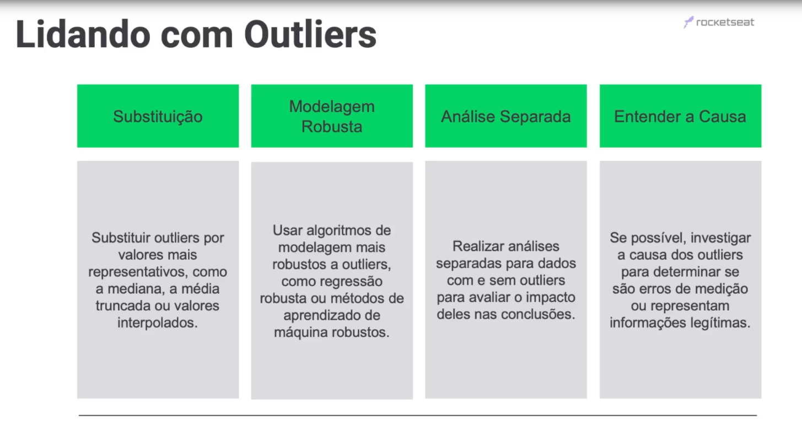

<!-- markdownlint-disable MD033 -->
<!-- markdownlint-disable MD024 -->

# Módulo 4 - Análise Exploratória de Dados com Pandas

> [voltar](./notes.md) para página anterior.

## Sumário

- [Módulo 4 - Análise Exploratória de Dados com Pandas](#módulo-4---análise-exploratória-de-dados-com-pandas)
  - [Sumário](#sumário)
  - [Conceitos](#conceitos)
    - [O que é a Biblioteca Pandas?](#o-que-é-a-biblioteca-pandas)
    - [Qual o objetivo do EAD - Exploratory Data Analysis?](#qual-o-objetivo-do-ead---exploratory-data-analysis)
    - [Análise Exploratória de Dados](#análise-exploratória-de-dados)
      - [Coleta e Preparação de dados](#coleta-e-preparação-de-dados)
      - [Formulação de Hipóteses](#formulação-de-hipóteses)
      - [Tipos de Análises](#tipos-de-análises)
      - [Comunicação dos Resultados](#comunicação-dos-resultados)
      - [Lidando com valores ausentes e *outliers*](#lidando-com-valores-ausentes-e-outliers)
      - [Tipo de dados ausentes](#tipo-de-dados-ausentes)
      - [Formulando Hipóteses](#formulando-hipóteses)
    - [Análise Bivariada](#análise-bivariada)
    - [Lidando com *Outliers*](#lidando-com-outliers)
      - [Consulta ChatGPT 3.5](#consulta-chatgpt-35)
      - [O que é Método Tukey?](#o-que-é-método-tukey)
      - [O que é Método Z-score?](#o-que-é-método-z-score)
    - [Automatizando EDA](#automatizando-eda)
      - [Consulta ChatGPT 3.5](#consulta-chatgpt-35-1)

## Conceitos

### O que é a Biblioteca Pandas?

O Pandas é uma módulo de Python amplamente usada para análise de dados. Sua principal vantagem é usa capacidade de manipular, limpar e analisar dados de forma eficiente. Ele fornece estruturas de dados flexíveis, como *Series* e *DataFrames*, que permitem organizar dados em tabelas, realizar operações complexas, como filtros e agregações, e facilitar a visualização dos resultados. O Pandas também é compatível com várias fontes de dados, como arquivo `CSV`, aquivos de Excel e banco de dados, tornando-os essencial para cientistas de dados e analistas que desejam explorar e extrair *insights* de dados de maneira eficaz e intuitiva.

**Conceito ChatGPT-3.5**:

A biblioteca Pandas é uma biblioteca de código aberto amplamente usada na linguagem de programação Python para manipulação e análise de dados. Ela fornece estruturas de dados e funções que tornam mais fácil a tarefa de trabalhar com dados tabulares, como planilhas ou tabelas de bancos de dados. Pandas é uma escolha popular para cientistas de dados, analistas de dados e desenvolvedores devido à sua eficiência e facilidade de uso.

> [voltar](#sumário) para o topo da página.

### Qual o objetivo do EAD - Exploratory Data Analysis?

O objetivo da Análise Exploratória de Dados é dar uma boa espiada nos dados antes de começar a fazer coisas mais complicadas. É como o investigador curioso que olha primeiro para entender do que se trata. A análise ajuda a descobrir segredos escondidos nos números, padrões estranhos e até erros, para que possamos tomar decisões mais inteligentes e contar histórias mais interessantes com nossos dados. É como a primeira pista em um quebra-cabeças gigante de informações. EAD é um processo sistemático usado em projetos de ciência de dados para entender e resumir as características fundamentais de um conjunto de dados.

**Conceito ChatGPT-3.5**:

A Exploratory Data Analysis (Análise Exploratória de Dados, em português), geralmente abreviada como EDA, é uma etapa fundamental no processo de análise de dados. Seu objetivo principal é examinar e entender os dados disponíveis antes de realizar análises estatísticas mais avançadas ou modelagem. O EDA é frequentemente usado em campos como ciência de dados, estatística, aprendizado de máquina e pesquisa científica para obter insights iniciais sobre os dados e identificar padrões, tendências e anomalias.

Aqui estão alguns dos principais objetivos do EDA:

1. Resumir dados: EDA ajuda a resumir os principais aspectos dos dados, como médias, medianas, desvios padrão e quartis. Isso fornece uma visão geral das características centrais dos dados.

2. Identificar padrões e tendências: EDA ajuda a identificar padrões, tendências e relações entre variáveis nos dados. Isso pode incluir a identificação de correlações, sazonalidades ou mudanças ao longo do tempo.

3. Detectar anomalias: EDA ajuda a identificar valores atípicos ou anomalias nos dados, que podem ser erros de entrada ou informações importantes para investigar mais a fundo.

4. Explorar distribuições: EDA permite visualizar as distribuições de variáveis, como histogramas, gráficos de densidade e gráficos de caixa, para entender melhor a forma como os dados estão distribuídos.

5. Selecionar variáveis relevantes: Ao examinar as relações entre variáveis, o EDA pode ajudar na seleção de variáveis importantes para análises subsequentes, como modelagem estatística ou aprendizado de máquina.

6. Gerar hipóteses: A análise exploratória muitas vezes gera hipóteses que podem ser testadas posteriormente com métodos estatísticos mais rigorosos.

7. Comunicar resultados: Visualizações e resumos gerados durante a EDA são frequentemente usados para comunicar resultados a partes interessadas e colegas.

Em resumo, a Exploratory Data Analysis é uma etapa crucial no processo de análise de dados, pois ajuda a compreender melhor os dados, identificar padrões e anomalias, e guiar análises estatísticas subsequentes. Ela permite que os analistas de dados obtenham uma visão mais profunda dos dados antes de realizar análises mais avançadas e tomar decisões informadas com base nas informações obtidas.

> [voltar](#sumário) para o topo da página

### Análise Exploratória de Dados

#### Coleta e Preparação de dados

A coleta e preparação de dados são duas etapas fundamentais no processo de análise de dados. Essas etapas são essenciais para garantir que os dados estejam limpos, organizados e prontos para serem usados em análises subsequentes. Aqui estão algumas informações sobre cada uma dessas etapas:

**Coleta de Dados:**

1. **Definição de Objetivos:** Antes de coletar dados, é importante definir claramente os objetivos da coleta de dados. Você deve saber quais perguntas deseja responder ou que problemas deseja resolver com os dados.

2. **Fontes de Dados:** Identifique as fontes de onde os dados serão coletados. Isso pode incluir bancos de dados, planilhas, fontes de dados na web, sensores, sistemas de registro, entre outros.

3. **Métodos de Coleta:** Determine os métodos de coleta de dados apropriados para as fontes selecionadas. Isso pode envolver pesquisa de campo, coleta automática de dados, entrevistas, questionários ou até mesmo aquisição de dados de terceiros.

4. **Limpeza e Validação:** Durante a coleta, é importante garantir que os dados estejam sendo coletados de maneira precisa e completa. Isso envolve a validação de dados em tempo real e a identificação de erros ou valores ausentes que precisam ser corrigidos.

5. **Armazenamento:** Armazene os dados coletados de maneira segura e organizada. Bancos de dados relacionais ou não relacionais são frequentemente usados para esse fim, dependendo da natureza dos dados.

**Preparação de Dados (Pré-processamento):**

1. **Limpeza de Dados:** Nesta etapa, os dados são limpos para remover quaisquer erros, duplicatas ou valores ausentes. Isso pode envolver a imputação de valores ausentes, correção de erros de digitação e tratamento de outliers (valores extremos).

2. **Transformação de Dados:** Os dados podem precisar ser transformados para atender às necessidades da análise. Isso pode incluir normalização (colocar todos os dados na mesma escala), codificação de variáveis categóricas, agregação de dados de séries temporais, entre outras transformações.

3. **Seleção de Características:** Em alguns casos, nem todas as características (variáveis) dos dados são relevantes para a análise. A seleção de características envolve a escolha das características mais importantes para o problema em questão.

4. **Engenharia de Recursos:** Às vezes, é útil criar novas características com base nas existentes para melhorar a capacidade do modelo de aprender padrões. Isso é conhecido como engenharia de recursos.

5. **Divisão de Dados:** Os dados são frequentemente divididos em conjuntos de treinamento e teste para modelagem. Isso permite avaliar o desempenho do modelo em dados não vistos.

6. **Normalização e Padronização:** Dependendo dos requisitos do modelo, os dados podem ser normalizados (escala entre 0 e 1) ou padronizados (média zero, desvio padrão 1) para garantir que as características tenham o mesmo impacto na análise.

A coleta e preparação de dados são processos críticos e consomem tempo, mas são fundamentais para garantir que as análises subsequentes sejam precisas e confiáveis. Essas etapas também ajudam a evitar vieses e erros nos resultados da análise, garantindo que os dados estejam prontos para revelar insights valiosos.

#### Formulação de Hipóteses

A formulação de hipóteses desempenha um papel crucial no processo de pesquisa e análise de dados. Uma hipótese é uma suposição educada ou uma proposição que descreve uma relação esperada entre variáveis ou um fenômeno que se deseja investigar. Aqui estão alguns pontos-chave sobre a formulação de hipóteses:

1. **Hipóteses Descritivas vs. Hipóteses de Teste:**
   - **Hipóteses Descritivas:** São suposições que descrevem uma relação geral entre variáveis, mas não são testáveis diretamente. Elas são frequentemente usadas em pesquisas exploratórias para gerar insights iniciais.
   - **Hipóteses de Teste:** São suposições específicas que podem ser testadas empiricamente usando dados coletados. Essas hipóteses geralmente incluem uma afirmação sobre a relação entre variáveis que pode ser aceita ou rejeitada com base em evidências.

2. **Características de uma Hipótese Eficaz:**
   - **Clareza:** Deve ser clara e precisa, descrevendo a relação ou o efeito esperado de maneira não ambígua.
   - **Testabilidade:** Deve ser possível testar a hipótese usando métodos e dados disponíveis.
   - **Falsificabilidade:** Deve haver uma maneira de potencialmente provar a hipótese como falsa, caso contrário, ela não é cientificamente válida.
   - **Relação com os Dados:** A hipótese deve estar relacionada ao problema de pesquisa e aos dados coletados.

3. **Exemplo de Hipótese de Teste:** Suponha que você esteja conduzindo uma pesquisa sobre o efeito de um novo medicamento na redução da pressão arterial. Uma hipótese de teste pode ser formulada da seguinte maneira:

   - **Hipótese Nula (H0):** O novo medicamento não tem efeito significativo na redução da pressão arterial (ou seja, a média da pressão arterial na população não muda com o medicamento).
   - **Hipótese Alternativa (Ha):** O novo medicamento tem um efeito significativo na redução da pressão arterial (ou seja, a média da pressão arterial na população diminui com o medicamento).

4. **Métodos para Testar Hipóteses:** Depois de formular hipóteses de teste, você pode usar métodos estatísticos para avaliar se os dados coletados oferecem suporte à hipótese nula ou a rejeitam em favor da hipótese alternativa. Isso pode envolver o uso de testes de hipóteses, análise de variância (ANOVA), regressão, entre outros métodos estatísticos.

5. **Iteração e Revisão:** É comum que as hipóteses evoluam à medida que a pesquisa avança. Às vezes, os resultados iniciais podem levar a uma reformulação das hipóteses ou ao desenvolvimento de novas hipóteses com base nas descobertas.

6. **Importância da Formulação de Hipóteses:** A formulação cuidadosa de hipóteses ajuda a orientar a pesquisa, estruturar a coleta de dados e interpretar os resultados. Ela também ajuda a comunicar claramente as expectativas e objetivos da pesquisa para outras pessoas envolvidas no projeto.

Em resumo, a formulação de hipóteses é uma parte fundamental do processo de pesquisa e análise de dados. Ela ajuda a direcionar a investigação, fornecendo uma estrutura clara para testar relações ou efeitos esperados, tornando assim a análise de dados mais focada e significativa.

#### Tipos de Análises

A análise de dados pode ser dividida em vários tipos, dependendo do número de variáveis envolvidas e do objetivo da análise. Aqui está um breve resumo dos quatro tipos mencionados:

1. **Análise Univariada:**
   - **Definição:** A análise univariada é uma abordágem estatística que se concentra na análise de uma única variável em um conjunto de dados. Ela visa compreender as caracterpisticas individuais dessa variável, examinando sua distribuição, medidas resumo (ex: média e mediana), variabilidade e a presença de valores atípicos (*outliers*). Isso ajuda a obter uma visão detalhada das características de uma variável específica, antes de explorar as relações com outras variáveis (análise bivariada ou multivariada) durante a análise de dados.
   - **Definição ChatGPT 3.5:** A análise univariada envolve a exploração de uma única variável de cada vez.
   - **Objetivo:** O objetivo principal é descrever e resumir os dados de uma variável específica. Isso inclui calcular estatísticas descritivas, como média, mediana, desvio padrão e criar visualizações, como histogramas, gráficos de barras ou gráficos de caixa.
   - **Exemplo:** Ao analisar as alturas de um grupo de pessoas, a análise univariada se concentraria apenas na variável "altura" e descreveria suas características estatísticas e distribuição.

2. **Análise Bivariada:**
   - **Definição:** A análise bivariada envolve o estudo de duas variáveis simultaneamente para entender a relação entre elas.
   - **Objetivo:** O objetivo é identificar e quantificar relações, associações ou correlações entre duas variáveis. Isso pode ser feito usando gráficos de dispersão, coeficientes de correlação e testes estatísticos específicos.
   - **Exemplo:** Ao analisar as alturas e os pesos de um grupo de pessoas, a análise bivariada exploraria como o peso se relaciona com a altura e se há uma correlação entre essas duas variáveis.

3. **Análise Multivariada:**
   - **Definição:** A análise multivariada envolve o estudo de três ou mais variáveis simultaneamente.
   - **Objetivo:** O objetivo é entender as interações complexas entre múltiplas variáveis e como elas influenciam umas às outras. Métodos multivariados incluem análise de regressão múltipla, análise de componentes principais, análise de clusters e análise fatorial, entre outros.
   - **Exemplo:** Ao analisar a satisfação do cliente em uma empresa, a análise multivariada pode considerar variáveis como qualidade do produto, atendimento ao cliente, preço e localização para entender como todas essas variáveis afetam a satisfação geral do cliente.

4. **Análise Temporal:**
   - **Definição:** A análise temporal envolve a observação e o estudo de dados ao longo do tempo, geralmente em intervalos regulares.
   - **Objetivo:** O objetivo é identificar tendências, padrões sazonais e variações ao longo do tempo. Isso pode ajudar a prever futuros valores e tomar decisões baseadas em séries temporais.
   - **Exemplo:** Ao analisar as vendas mensais de um produto, a análise temporal investigaria como as vendas variam ao longo dos meses e anos, identificando sazonalidades, tendências ascendentes ou descendentes e picos sazonais.

Cada tipo de análise tem seus próprios métodos e técnicas específicas para explorar e interpretar os dados. A escolha do tipo de análise depende dos objetivos da pesquisa e da natureza das variáveis em estudo.

#### Comunicação dos Resultados

A comunicação de resultados desempenha um papel fundamental no contexto da Análise Exploratória de Dados (EDA). EDA é uma etapa essencial na análise de dados, onde os analistas exploram os dados, identificam padrões, tendências e anomalias antes de realizar análises estatísticas mais avançadas ou construir modelos. Comunicar efetivamente os resultados da EDA é importante por várias razões:

1. **Tomada de Decisão Informada:** A EDA fornece informações valiosas sobre os dados, o que pode influenciar decisões de negócios, estratégias de pesquisa, políticas governamentais e muito mais. A comunicação eficaz dos resultados ajuda a garantir que as decisões sejam tomadas com base em evidências sólidas.

2. **Compreensão Compartilhada:** A EDA é frequentemente realizada por equipes multidisciplinares, incluindo cientistas de dados, analistas, gerentes e outros. Comunicar os resultados de forma clara e acessível ajuda a garantir que todos os membros da equipe tenham uma compreensão compartilhada dos insights extraídos dos dados.

3. **Transparência:** A transparência é fundamental em análise de dados, especialmente em contextos críticos. Comunicar os métodos, suposições e resultados da EDA permite que outros revisem e validem os resultados, promovendo a confiança nas conclusões.

4. **Identificação de Próximos Passos:** A EDA muitas vezes leva a novas perguntas e áreas de investigação. A comunicação dos resultados ajuda a identificar essas áreas e orienta os próximos passos na análise de dados.

Aqui estão algumas práticas recomendadas para a comunicação de resultados dentro do contexto de EDA:

1. **Relatórios Claros e Concisos:** Crie relatórios ou documentos que destaquem os principais resultados da EDA de maneira clara e concisa. Use gráficos, tabelas e visualizações para ilustrar os pontos-chave.

2. **Narrativa Coerente:** Conte uma história com os dados. Descreva o problema, a metodologia usada na EDA, os resultados obtidos e as implicações práticas de forma lógica e sequencial.

3. **Visualizações Significativas:** Use gráficos e visualizações apropriados para destacar os padrões e tendências identificados. Escolha visualizações que tornem os insights mais evidentes e fáceis de entender.

4. **Documentação Adequada:** Forneça detalhes sobre as etapas da EDA, incluindo qualquer pré-processamento de dados, transformações ou limpeza realizados. Isso permite que outros reproduzam os resultados.

5. **Discussão das Limitações:** Seja transparente sobre as limitações dos dados e da análise, incluindo qualquer viés potencial, dados ausentes ou incertezas. Isso ajuda a evitar interpretações excessivamente otimistas.

6. **Feedback e Colaboração:** Incentive o feedback de colegas e partes interessadas. A colaboração pode ajudar a aprimorar a qualidade da análise e a identificar perspectivas adicionais.

7. **Apresentações Eficazes:** Se necessário, faça apresentações ao vivo para explicar os resultados aos interessados. Use slides, gráficos e exemplos práticos para tornar a apresentação envolvente e informativa.

Em resumo, a comunicação de resultados desempenha um papel crucial na Análise Exploratória de Dados, pois ajuda a garantir que os insights extraídos sejam compreendidos, confiáveis e acionáveis. Uma comunicação eficaz dos resultados facilita a tomada de decisões informadas e a colaboração bem-sucedida em projetos de análise de dados.

#### Lidando com valores ausentes e *outliers*

Lidar com valores ausentes e outliers é uma parte crítica do processo de preparação de dados em análise de dados. Ambos podem afetar negativamente a qualidade das análises e modelos, por isso é importante tratá-los adequadamente. Aqui estão algumas estratégias comuns para lidar com valores ausentes e outliers:

**Valores Ausentes:**

1. **Identificação:** Primeiro, identifique os valores ausentes em seu conjunto de dados usando métodos como a contagem de valores nulos em cada variável.

2. **Remoção de Linhas ou Colunas:** Se os valores ausentes forem relativamente poucos em comparação com o tamanho total do conjunto de dados e não forem críticos, você pode optar por remover as linhas ou colunas que contenham esses valores. Isso é mais adequado quando a perda de dados é aceitável.

3. **Imputação:** Se a remoção de dados não for uma opção, você pode preencher os valores ausentes com valores substitutos. Isso pode incluir a imputação da média, mediana ou moda para variáveis numéricas, ou a imputação de categorias mais frequentes para variáveis categóricas. A escolha do método de imputação depende da natureza dos dados e do problema em questão.

4. **Modelos de Imputação:** Em alguns casos, é possível criar modelos para prever valores ausentes com base em outras variáveis. Isso é especialmente útil quando os valores ausentes são críticos e não podem ser removidos.

5. **Considerações Contextuais:** Lembre-se de que a imputação deve ser realizada com cuidado, levando em consideração o contexto dos dados. Imputar valores ausentes de forma inadequada pode distorcer a distribuição dos dados e afetar negativamente as análises.

**Outliers:**

1. **Identificação:** Identifique os outliers usando técnicas estatísticas, como o uso de gráficos de caixa (box plots), diagramas de dispersão (scatter plots) ou métodos estatísticos, como o Z-score ou o IQR (Intervalo Interquartil).

2. **Avaliação da Significância:** Avalie a significância dos outliers em relação ao problema de análise em questão. Nem todos os outliers são problemáticos, e alguns podem até conter informações valiosas.

3. **Transformação de Dados:** Em algumas situações, a transformação dos dados pode ajudar a reduzir a influência dos outliers. Isso pode incluir aplicar transformações logarítmicas ou raiz quadrada em variáveis numéricas.

4. **Tratamento Específico:** Dependendo do contexto, você pode optar por remover os outliers, especialmente se eles forem causados por erros de medição ou entrada de dados incorreta. Certifique-se de documentar as razões para a remoção.

5. **Modelos Robustos:** Em vez de remover outliers, você pode optar por usar modelos estatísticos ou algoritmos de aprendizado de máquina mais robustos que são menos sensíveis a outliers, como a regressão robusta ou algoritmos baseados em árvores.

6. **Binning ou Categorização:** Em algumas situações, você pode agrupar valores em intervalos (binning) ou categorizá-los para reduzir a influência dos outliers.

A abordagem para lidar com valores ausentes e outliers deve ser guiada pelo contexto dos dados e pelos objetivos da análise. É importante documentar todas as etapas do tratamento de valores ausentes e outliers para garantir a transparência e a replicabilidade da análise. Além disso, é fundamental entender o impacto das decisões tomadas sobre esses dados na interpretação final dos resultados.

#### Tipo de dados ausentes

O padrão de tipos de dados ausentes, também conhecido como "Missing Data Pattern," refere-se ao padrão ou à estrutura pela qual os valores ausentes estão distribuídos em um conjunto de dados. A compreensão desse padrão é importante na análise de dados, pois pode afetar a escolha das estratégias de tratamento de valores ausentes.

Existem vários padrões comuns de tipos de dados ausentes:

1. **Completamente Aleatório (MCAR - Missing Completely At Random):** Nesse padrão, a probabilidade de um valor estar ausente é a mesma para todas as observações. Em outras palavras, a ocorrência de valores ausentes não está relacionada às características observadas ou não observadas. Esse é o cenário mais desejável, pois não introduz viés na análise.

2. **Aleatório (MAR - Missing At Random):** Nesse padrão, a probabilidade de um valor estar ausente pode depender de outras variáveis observadas, mas não das variáveis ausentes. Isso significa que, embora os dados ausentes não sejam completamente aleatórios, eles podem ser tratados de forma adequada se as variáveis relevantes estiverem disponíveis. No entanto, é importante que os motivos para os dados estarem ausentes sejam ignoráveis (ou seja, não afetam as conclusões).

3. **Não Aleatório (MNAR - Missing Not At Random):** Nesse padrão, a probabilidade de um valor estar ausente está relacionada às próprias variáveis ausentes, ou seja, a ausência é influenciada por informações que não estão disponíveis no conjunto de dados. Os dados MNAR são mais desafiadores de lidar, pois podem introduzir viés e distorções significativas nas análises. Tratar dados MNAR requer métodos mais avançados e, muitas vezes, envolve suposições difíceis de validar.

A identificação do padrão de tipos de dados ausentes é crucial ao escolher a estratégia de tratamento apropriada:

- Para dados MCAR e MAR, a imputação de valores ausentes com base em métodos estatísticos (como média, mediana ou regressão) ou modelos de imputação é uma abordagem comum.

- Para dados MNAR, é necessário um cuidado extra e a escolha de técnicas mais avançadas, como modelos estatísticos que levem em consideração a natureza não aleatória dos dados ausentes. No entanto, a validação dessas suposições pode ser um desafio.

Além disso, é importante documentar o padrão de tipos de dados ausentes e qualquer abordagem de tratamento adotada, para garantir a transparência e a replicabilidade da análise. A compreensão do padrão de tipos de dados ausentes ajuda a tomar decisões informadas sobre como lidar com valores ausentes e minimizar o impacto de dados ausentes na análise final.

#### Formulando Hipóteses

1. **Use a intuição:** Comoçe com suas suspeitas iniciais com base no conhecimento do domínio. Pergunte a si mesmo o que espera encontrar nos dadso.

2. **Seja específico:** Suas hipóteses devem ser claras e específicas. Evite afirmações vagas como "os dados têm alguma tendência". Em vez disso, seja concreto, como "o aumento das vendas está relacionado ao lançamento do novo produto".

3. **Testabilidade:** Certifique-se de que suas hipóteses possam ser testadas com os dados disponíveis. Você deve ser capaz de encontrar evidências nos dados que confirmem ou refutem a hipótese.

4. **Considere Relações:** Pense como diferentes variáveis podem estar relacionadas. Por exemplo, "a idade dos clientes afeta a taxa de churn?" ou "a localização geográfica influencia as preferências de compras?".

Na análise exploratória de dados com o Pandas, a formulação de hipóteses é um passo crucial para direcionar sua investigação e testar suposições sobre os dados. Aqui está um resumo do processo:

- Entenda o contexto: Comece por compreender o contexto do seu conjunto de dados e os objetivos da análise. Isso ajudará a identificar as questões a serem exploradas.

- Explore os dados: Use o Pandas para carregar seus dados e realizar uma análise inicial. Isso envolve a identificação de estatísticas descritivas, como média, mediana, desvio padrão, e a criação de gráficos para visualizar os dados.

- Gere hipóteses: Com base na compreensão inicial dos dados, formule hipóteses sobre relações, tendências ou padrões que você suspeita existir no conjunto de dados. Por exemplo, "A idade dos clientes está relacionada ao valor médio das compras?".

- Escolha métodos estatísticos: Selecionar métodos estatísticos apropriados para testar suas hipóteses. O Pandas oferece funções para calcular estatísticas, como correlações, t-testes, ANOVA, e muito mais.

- Teste as hipóteses: Aplique os testes estatísticos aos dados para avaliar se as hipóteses são suportadas ou refutadas. Os resultados dos testes ajudarão a tomar decisões informadas.

- Interprete os resultados: Analise os resultados dos testes estatísticos e interprete o que eles significam em relação às hipóteses formuladas. Isso pode levar a novas questões ou direcionar sua análise de maneira diferente.

- Comunique as descobertas: Finalmente, comunique suas descobertas de forma clara e objetiva, destacando as hipóteses confirmadas ou refutadas, e suas implicações no contexto do problema ou questão original.

Lembrando que a análise exploratória de dados é um processo iterativo, e as hipóteses podem ser ajustadas à medida que você obtém mais informações e insights do conjunto de dados.

> [voltar](#sumário) para o topo da página

### Análise Bivariada

Análise Bivariada é um técnica de estatística que se encontra na relação entre duas variáveis em um conjunto de dados. Ela busca entender como um variável está relacionada à outra, frequentemente usando gráficos, tabelas cruzadas e cálculos de correlação. Isso ajuda a identificar padrões, associados e dependências entre as duas variáveis, fornecendo insights sobre como elas interagem, o que é cricial na análise de dados e na tomada de diciões informadas.

**Conceito ChatGPT:**

A análise bivariada é uma parte importante da análise exploratória de dados (AED) em estatística e ciência de dados. No contexto da AED, a análise bivariada se concentra na relação entre duas variáveis ​​em um conjunto de dados. Ela ajuda a entender como duas variáveis estão relacionadas entre si e como elas podem influenciar uma à outra.

A análise bivariada envolve a análise de duas variáveis em conjunto para identificar padrões, tendências e associações entre elas. Alguns dos métodos e técnicas comuns usados na análise bivariada incluem:

1. **Gráficos de dispersão:** Gráficos de dispersão mostram a relação entre duas variáveis, representando cada par de valores em um gráfico bidimensional. Isso pode ajudar a identificar se há alguma correlação entre as duas variáveis.

2. **Tabelas de contingência:** Tabelas de contingência são usadas para resumir a relação entre duas variáveis categóricas. Elas mostram a frequência de ocorrência de combinações de categorias das duas variáveis.

3. **Testes de associação:** Testes estatísticos, como o teste qui-quadrado, o teste t de Student e a correlação de Pearson, podem ser aplicados para quantificar a associação entre duas variáveis e determinar se essa associação é estatisticamente significativa.

4. **Análise de correlação:** A análise de correlação é usada para medir o grau e a direção da relação linear entre duas variáveis contínuas. O coeficiente de correlação, como o coeficiente de correlação de Pearson ou Spearman, é frequentemente utilizado para avaliar essa relação.

A análise bivariada é uma etapa fundamental na AED, pois ajuda a identificar relações preliminares entre variáveis e a gerar insights que podem orientar análises mais avançadas. Ela é frequentemente usada como ponto de partida antes de realizar análises multivariadas, onde várias variáveis são consideradas simultaneamente.

> [voltar](#sumário) para o topo da página

### Lidando com *Outliers*

Um outlier é um dado que é muito diferente dos outros dados em um conjunto. É um ponto fora da curva.

Por exemplo, imagine que você tenha um conjunto de dados que registra a altura de 100 pessoas. A média das alturas é de 1,70m. Um *outlier* seria uma pessoa de 2,5m metros de altura.

*Outliers* podem aparacer por diversos fatores, como erros de medição, dados incompletos ou eventos aleatórios. Como eles podem afetar os resultados de uma análise de dados, logo é importante indentíficá-los e tratá-los através de métodos específicos, como os listados na ilustração abaixo:

<div>
   
</div>

#### Consulta ChatGPT 3.5

Lidar com outliers em uma análise exploratória de dados é uma etapa importante, pois esses valores atípicos podem distorcer as análises estatísticas e prejudicar a interpretação dos dados. Aqui estão algumas abordagens comuns para lidar com outliers:

1. Identificação de outliers:
   - Utilize gráficos de dispersão, histogramas, box plots e estatísticas descritivas para identificar os outliers em seus dados.
   - Considere as características do problema e do domínio para determinar se um valor é realmente um outlier ou se tem significado estatístico.

2. Tratamento de outliers:
   - Remoção: Uma opção é remover os outliers do conjunto de dados. No entanto, isso deve ser feito com cuidado, pois a exclusão de dados pode resultar na perda de informações valiosas.
   - Transformação: Você pode aplicar transformações matemáticas aos dados, como a transformação logarítmica, para reduzir a influência dos outliers.
   - Substituição: Em vez de remover outliers, você pode substituí-los por valores mais típicos, como a mediana ou a média truncada (média calculada após a remoção de outliers).
   - Segmentação: Em alguns casos, pode ser útil segmentar os dados em grupos distintos, tratando os outliers de forma diferente em cada grupo.

3. Análise sensível a outliers:
   - Use métodos de estatística robusta que são menos sensíveis a outliers, como a mediana em vez da média.
   - Utilize testes de hipóteses robustos que não são influenciados por valores extremos.

4. Visualização:
   - Ao criar visualizações, como gráficos de dispersão, marque os outliers para que eles possam ser identificados facilmente.
   - Considere a criação de gráficos separados para destacar os outliers, se necessário.

5. Avaliação do impacto:
   - Analise como a presença ou remoção de outliers afeta suas conclusões e decisões. É importante documentar todas as etapas de tratamento de outliers e justificar suas escolhas.

Lembre-se de que o tratamento de outliers deve ser feito com cautela, dependendo do contexto do problema e das características dos dados. Em alguns casos, os outliers podem conter informações valiosas ou ser de interesse para a análise. Portanto, é importante entender o impacto das decisões sobre outliers em relação aos objetivos da análise de dados.

#### O que é Método Tukey?

O método de Tukey, também conhecido como Teste de Tukey ou Análise de Intervalo de Tukey, é uma técnica estatística utilizada para identificar diferenças significativas entre as médias de múltiplos grupos em um conjunto de dados. Ele foi desenvolvido pelo estatístico John Tukey e é comumente utilizado em experimentos de comparação múltipla, onde se deseja determinar quais grupos são estatisticamente diferentes entre si.

O método de Tukey é frequentemente aplicado em análises de variância (ANOVA) para avaliar se há diferenças significativas entre os grupos e, caso haja, identificar quais grupos específicos são diferentes uns dos outros. O procedimento de Tukey envolve a comparação de todas as combinações possíveis de médias de grupos e o cálculo de intervalos de confiança para essas diferenças. Se a diferença entre duas médias estiver fora do intervalo de confiança, isso indica que as médias são estatisticamente diferentes.

O método de Tukey é especialmente útil quando você tem vários grupos para comparar, pois ele controla o erro global de comparação múltipla, evitando a inflação de erro tipo I. Isso o torna uma ferramenta valiosa na análise de dados em experimentos, estudos clínicos, pesquisas de mercado e em muitos outros campos da ciência e da estatística.

Em resumo, o método de Tukey é uma técnica estatística que ajuda a determinar quais grupos em um conjunto de dados têm médias significativamente diferentes, sendo uma ferramenta importante na análise estatística e na tomada de decisões com base em dados.

Você pode aplicar o método de Tukey para identificar diferenças significativas entre as médias de grupos em um conjunto de dados utilizando a biblioteca Pandas em Python. Para fazer isso, você pode usar a biblioteca `scipy` juntamente com o módulo `stats` para realizar a análise estatística. Aqui está um exemplo passo a passo de como aplicar o teste de Tukey em Python:

1. Importe as bibliotecas necessárias:

   ```python
   import pandas as pd
   from scipy import stats
   from statsmodels.stats.multicomp import pairwise_tukeyhsd
   ```

2. Carregue seus dados em um DataFrame do Pandas. Suponhamos que você tenha um DataFrame chamado `df` com uma coluna 'Grupo' que identifica os grupos e uma coluna 'Valor' contendo os valores a serem comparados:

   ```python
   df = pd.DataFrame({
      'Grupo': ['A', 'A', 'B', 'B', 'C', 'C'],
      'Valor': [10, 12, 15, 17, 9, 11]
   })
   ```

3. Realize a análise de variância (ANOVA) para verificar se há diferenças significativas entre os grupos:

   ```python
   f_statistic, p_value = stats.f_oneway(df['Valor'][df['Grupo'] == 'A'], 
                                       df['Valor'][df['Grupo'] == 'B'], 
                                       df['Valor'][df['Grupo'] == 'C'])
   ```

4. Se o resultado da ANOVA for estatisticamente significativo (ou seja, p-value < 0.05), você pode prosseguir com o teste de Tukey para identificar quais grupos são diferentes entre si:

   ```python
   if p_value < 0.05:
      tukey_result = pairwise_tukeyhsd(df['Valor'], df['Grupo'])
      print(tukey_result)
   ```

5. O resultado do teste de Tukey mostrará as diferenças significativas entre os grupos, incluindo os intervalos de confiança e os valores críticos. Você pode interpretar os resultados para determinar quais grupos são estatisticamente diferentes entre si.

Lembre-se de que é importante entender os princípios estatísticos por trás desses testes antes de aplicá-los e interpretar os resultados de forma adequada. Certifique-se de ajustar o código para o seu conjunto de dados específico e suas necessidades de análise.

#### O que é Método Z-score?

O método de Z-score, também conhecido como escore padrão, é uma técnica estatística utilizada para avaliar a posição de um valor em relação à média de um conjunto de dados e sua dispersão. O Z-score mede o número de desvios padrão que um valor específico está acima ou abaixo da média. Isso ajuda a determinar o quão atípico ou comum um valor é em relação ao restante dos dados.

Os Z-scores são frequentemente usados para identificar valores atípicos (outliers) em uma distribuição de dados, sendo valores com Z-scores significativamente altos ou baixos considerados incomuns em comparação com o restante dos dados. Além disso, os Z-scores podem ser usados para padronizar dados, tornando-os comparáveis quando as unidades de medida são diferentes.

É possível aplicar o Z-score a um conjunto de dados usando a biblioteca Python pandas. Primeiro, você precisa calcular a média e o desvio padrão dos seus dados e, em seguida, aplicar a fórmula do Z-score a cada valor. Aqui está um exemplo passo a passo:

1. Importe as bibliotecas necessárias:

   ```python
   import pandas as pd
   import numpy as np
   ```

2. Crie um DataFrame com seus dados. Por exemplo:

   ```python
   data = {'Valor': [10, 20, 30, 40, 50]}
   df = pd.DataFrame(data)
   ```

3. Calcule a média e o desvio padrão dos seus dados:

   ```python
   mean = df['Valor'].mean()
   std = df['Valor'].std()
   ```

4. Aplique a fórmula do Z-score aos valores da coluna 'Valor' e armazene os resultados em uma nova coluna 'Z-Score' no DataFrame:

   ```python
   df['Z-Score'] = (df['Valor'] - mean) / std
   ```

Agora, o DataFrame terá uma coluna 'Z-Score' contendo os valores do Z-score para cada valor na coluna 'Valor'. Você pode usar essa informação para identificar valores atípicos, se necessário. Certifique-se de que a coluna 'Valor' contenha os dados aos quais você deseja aplicar o Z-score.

> [voltar](#sumário) para o topo da página

### Automatizando EDA

A Automatização da análise exploratória de dados (EDA) oferece uma série de vantagens, incluindo:

- **Aumento da velocidade e da eficiência:** a EDA automatizada pode ser executada muito mais rapidamente de que a EDA manaul. Isso pode ser importante para conjuntos de dados grandes ou complexos.
- **Redução da subjetividade:** A EDA automatizada é menos propensa a erros ou viesses humanos. Isso pode levar a análises mais precisas e confiáveis.
- **Melhor compreensão dos dados:** A EDA automatizada pode identificar padrões e tendências que podem não ser óbvios para os analistas humanos. Isso pode ajudar a obter não ser óbvios para os analistas humanos. Isso pode ajudar a obter uma melhor compreensão dos dados e a tomar melhores decisões.

#### Consulta ChatGPT 3.5

A automação da Análise Exploratória de Dados (EDA) envolve o uso de ferramentas e scripts para realizar tarefas repetitivas de exploração de dados de forma mais eficiente. Aqui estão algumas etapas para automatizar um EDA:

1. Coleta de Dados:
   - Configure um pipeline de coleta de dados que busca automaticamente os dados de suas fontes, como bancos de dados, APIs, arquivos CSV, etc.
   - Agende tarefas para atualizar os dados regularmente, se necessário.

2. Pré-processamento de Dados:
   - Automatize a limpeza de dados, incluindo preenchimento de valores ausentes, tratamento de outliers e transformações de dados.
   - Use scripts ou ferramentas para padronizar a formatação dos dados.

3. Visualizações Automatizadas:
   - Crie scripts que gerem visualizações de dados, como gráficos de dispersão, histogramas, box plots e outros gráficos relevantes.
   - Utilize bibliotecas de visualização de dados, como Matplotlib, Seaborn ou Plotly em Python, para criar visualizações de forma programática.

4. Análise Estatística:
   - Desenvolva scripts para calcular estatísticas descritivas, como média, mediana, desvio padrão, correlações, etc.
   - Automatize a identificação de tendências e padrões nos dados, como sazonalidades ou anomalias.

5. Análise de Texto:
   - Se os seus dados incluem texto, utilize processamento de linguagem natural (NLP) para automatizar a análise de texto, como extração de palavras-chave, análise de sentimentos e classificação de documentos.

6. Relatórios Automatizados:
   - Crie scripts para gerar relatórios automaticamente, incluindo resultados de análise, visualizações e insights.
   - Use ferramentas como Jupyter Notebooks, RMarkdown, ou bibliotecas de geração de relatórios em HTML ou PDF.

7. Integração com Dashboards:
   - Integre os resultados da automação de EDA em dashboards interativos usando ferramentas como Tableau, Power BI, ou bibliotecas como Dash (para Python).
   - Isso permite que os usuários explorem os dados de forma interativa.

8. Monitoramento e Atualização:
   - Estabeleça um sistema de monitoramento que verifica a qualidade dos dados, a precisão das análises e a integridade dos resultados automaticamente.
   - Automatize a atualização do EDA sempre que novos dados estejam disponíveis.

9. Versionamento:
   - Utilize sistemas de controle de versão, como Git, para rastrear as mudanças nos scripts e nos resultados da análise.

10. Documentação:

- Documente seus scripts, fluxos de trabalho e resultados para que outros membros da equipe possam entender e utilizar a automação do EDA.

Lembre-se de que a automação do EDA não é uma solução única para todos os casos. A complexidade e os requisitos específicos variam de projeto para projeto. Portanto, adapte a automação às necessidades do seu projeto e esteja preparado para ajustá-la à medida que os requisitos mudam.

> [voltar](#sumário) para o topo da página
>
> [voltar](./notes.md) para página anterior.
